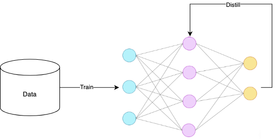

# Eigen Knowledge Distillation Python Library

This repository is meant to provide an end-to-end implementation of Knowledge Distillation (KD) techniques (offline, online, self) for model compression and optimization. The goal is to democratize ML model inference through distillation.

## How Eigen Can Help You with Knowledge Distillation

### 1️⃣ Deploying AI on Mobile 📱  
**Have a new vision segmentation model but don't want it to drain memory or battery on mobile devices?**  
💡 Distill the model down to a smaller architecture using **Eigen's offline distillation**, keeping accuracy while reducing compute costs.  

### 2️⃣ Making LLMs Cheaper & Faster 🧠⚡  
**Have a powerful LLM but it's too slow and expensive to deploy in production?**  
💡 Use **Eigen's online distillation** to train a smaller student LLM in real-time while retaining knowledge from the original model.  

### 3️⃣ Optimizing Edge AI for IoT & Robotics 🤖🌍  
**Want to run an object detection model on an edge device but can't afford a massive YOLO or Faster R-CNN?**  
💡 Apply **feature-based distillation** with Eigen to compress the model while preserving detection accuracy.  

### 4️⃣ Speeding Up Vision Transformers (ViTs) 🖼️⚡  
**Training a ViT but need efficient inference without losing too much performance?**  
💡 Use **self-distillation** to refine the model's internal representations, reducing redundancy while improving feature extraction.  

### 5️⃣ Accelerating Generative AI 🎨💨  
**Want faster inference for a diffusion model or GAN without sacrificing image quality?**  
💡 Use **contrastive distillation** in Eigen to train a lightweight generative model that runs faster while keeping high visual fidelity.  

## Features 
- [ ] Offline: Soft Target Distiller - Student learns the teachers's soft logits
  - [x] Single teacher, Single student pipeline
  - [ ] Single teacher, Many students pipeline
    - [ ] Parallel Distillation: Training multiple students concurrently using the same teacher predictions.
    
  - [ ] Many teachers, Single student pipeline
    - [ ] Weighted averaging of teachers' weights (Equal weights by default)
    - [ ] Adaptive Weighing: gating networks/attention mechanisms
    - [ ] Adaptive Weighing: confidence based
    - [ ] Teacher Selection: sample-specific teacher selection 
    - [ ] Teacher Selection: mixture of experts 

  - [ ] Many teachers, Many student pipeline  
    - [ ] Parallel Multi-Teacher Distillation
    - [ ] Peer-to-Peer Distillation
    - [ ] Clustered Teacher Assignments
    - [ ] Inter-Student Communication 

## Installation
To install the library, you can clone this repository and install the dependencies using pip:
```bash
git clone https://github.com/0xd1rac/eigen-distill-lib.git
cd eigen-distill-lib
pip install -r requirements.txt
```

## Distillation with Eigen
Eigen provides a comprehensive suite of distillation techniques to optimize and compress machine learning models. Here's an overview of the available methods:

### Offline Distillation

Offline distillation involves training a student model using a pre-trained teacher model. This process is typically done in a batch setting, where the teacher's knowledge is transferred to the student through various strategies.


### Online Distillation

Online distillation allows the student model to learn from the teacher model in real-time during training. This approach is beneficial for scenarios where the teacher model is continuously updated or when training data is streamed.


### Self-Distillation

Self-distillation involves a single model learning from its own predictions or internal representations. This technique can improve model performance by refining its feature extraction capabilities.




## Usage 
### 1. Offline Distillation: Multi-Layer Activation Strategy

Here's an example of how to use the `MultiLayerActivationDistiller` for offline distillation:

```python
import torch
import torch.nn as nn
import torch.optim as optim
from torchvision import models
from distill_lib.offline.multilayer_activation_distiller import MultiLayerActivationDistiller
from examples.utils import get_dataloaders, evaluate

# Set up the device
device = 'cuda' if torch.cuda.is_available() else 'cpu'

# Load data
train_loader, test_loader = get_dataloaders()

# Initialize teacher and student models
teacher = models.resnet50(pretrained=True)
teacher.fc = nn.Linear(teacher.fc.in_features, 10)
teacher = teacher.to(device)

student = models.resnet18(pretrained=False)
student.fc = nn.Linear(student.fc.in_features, 10)
student = student.to(device)

# Specify layers to hook
student_layers = ['layer1', 'layer2', 'layer3', 'layer4']
teacher_layers = ['layer1', 'layer2', 'layer3', 'layer4']

# Set up optimizer and distiller
optimizer = optim.SGD(student.parameters(), lr=0.1, momentum=0.9, weight_decay=5e-4)
distiller = MultiLayerActivationDistiller(student, teacher, optimizer=optimizer,
                                          student_layers=student_layers, teacher_layers=teacher_layers)

# Distillation parameters
num_epochs = 1
alpha = 0.5  # Weight for activation loss

# Perform distillation
distiller.distill(train_loader, num_epochs, device, alpha=alpha)

# Evaluate the student model
test_acc = evaluate(student, test_loader, device)
print(f"Test Accuracy: {test_acc:.2f}%")
```

This example demonstrates how to set up and run a distillation process using a larger ResNet50 model as the teacher and a smaller ResNet18 model as the student. The `MultiLayerActivationDistiller` captures intermediate activations from specified layers to guide the student's learning process.

### 2. Offline Distillation: Soft Target Strategy

Here's an example of how to use the `SoftTargetDistiller` for offline distillation:

```python
import torch
import torch.nn as nn
import torch.optim as optim
from torchvision import models
from distill_lib.offline.soft_target_distiller import SoftTargetDistiller
from examples.utils import get_dataloaders, evaluate

# Set up the device
device = 'cuda' if torch.cuda.is_available() else 'cpu'

# Load data
train_loader, test_loader = get_dataloaders()

# Initialize teacher and student models
teacher = models.resnet50(pretrained=True)
teacher.fc = nn.Linear(teacher.fc.in_features, 10)
teacher = teacher.to(device)

student = models.resnet18(pretrained=False)
student.fc = nn.Linear(student.fc.in_features, 10)
student = student.to(device)

# Set up optimizer and distiller
optimizer = optim.SGD(student.parameters(), lr=0.1, momentum=0.9, weight_decay=5e-4)
distiller = SoftTargetDistiller(student, teacher, optimizer=optimizer)

# Distillation parameters
num_epochs = 1
alpha = 0.5  # Weight for distillation loss
temperature = 2.0  # Temperature for softening outputs

# Perform distillation
distiller.distill(train_loader, num_epochs, device, alpha=alpha, temperature=temperature)

# Evaluate the student model
test_acc = evaluate(student, test_loader, device)
print(f"Test Accuracy: {test_acc:.2f}%")
```

This example demonstrates how to set up and run a soft target distillation process using a larger ResNet50 model as the teacher and a smaller ResNet18 model as the student. The `SoftTargetDistiller` uses the teacher's softened outputs to guide the student's learning process.
